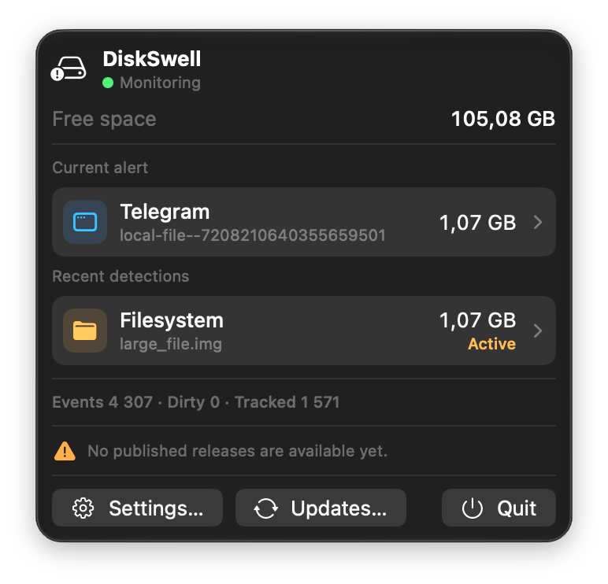

# DiskSwell

DiskSwell is a native macOS menu bar utility that detects abnormal disk-usage growth, shows the affected file or folder, and identifies the likely application when possible. It is detection-only: it never deletes files, truncates WALs, checkpoints databases, or terminates applications.

## Why it exists

DiskSwell began after Safari silently grew a WebKit SQLite write-ahead log to **51 GB** on my Mac. Free space kept disappearing, but macOS did not clearly show what was growing or which app was responsible. I wanted a small monitor that would catch the next runaway file early, show its path and likely owner, and leave cleanup decisions to me.

DiskSwell processes monitoring data locally with no telemetry, analytics, accounts, or uploads. Networking is used only for optional update checks and user-approved downloads from GitHub Releases. See [PRIVACY.md](PRIVACY.md), [SECURITY.md](SECURITY.md), and [CONTRIBUTING.md](CONTRIBUTING.md).

<div align="center">
  
</div>

## What it does

- Watches bounded user locations using native FSEvents; it never scans the whole disk.
- Detects sudden growth, slow multi-day growth, large Safari/WebKit WAL files, and low free space.
- Shows the likely app, main path, size, growth, and timestamps, with **Show in Finder** for inspection.
- Runs quietly from the menu bar with local SQLite history and optional native notifications.
- Never cleans, terminates, uploads, or modifies monitored data.

## Problems it helps identify

DiskSwell can help when **Mac disk space keeps disappearing**, a **Safari or WebKit WAL file grows to tens of gigabytes**, an **application container rapidly expands**, or you need to find **which app is creating a large file on macOS**. It monitors growth over time rather than acting as another static disk-usage browser.

## Installation

DiskSwell requires macOS 14 or later. Install the signed and notarized package from [GitHub Releases](https://github.com/kricha-lab/DiskSwell/releases), or use the owner-maintained Homebrew tap:

```sh
brew install --cask kricha-lab/tap/diskswell
```

Installed copies check GitHub Releases at most once per day by default. This can be disabled in Settings; manual checks remain available. DiskSwell downloads an update only after confirmation, verifies its SHA-256, and opens the signed package in macOS Installer.

For local development, build from source with the Release command under [Development](#development). Local ad-hoc builds are for testing only and should not be redistributed.

## Monitoring architecture

```text
FSEvents callback (system CoreServices API)
  -> compact, bounded AsyncStream handoff
  -> MonitoringEngine actor
  -> 750 ms event coalescing
  -> bounded dirty paths
  -> targeted file metadata / bounded directory inspection
  -> bounded leaf deltas + bounded directory aggregates
  -> recent + persisted 24-hour/7-day/30-day detection
  -> generic + aggregate + Safari/WebKit + free-space detection
  -> notification transition/cooldown policy
  -> native UserNotifications + SQLite history
  -> small immutable menu-bar snapshots
```

The FSEvents callback converts paths immediately and retains at most 8,192 paths from one native batch. The async handoff keeps the newest eight batches. It creates no task per event; one actor-owned consumer handles the stream and one actor-owned debounce task handles a coalescing window. DiskSwell's own Application Support directory is excluded at event handoff and during bounded parent-directory inspection, preventing SQLite history writes from feeding back into monitoring. When the filesystem is idle, only the 30-minute safety task wakes; it runs the targeted audit only after 24 hours have elapsed.

Default configured roots are `~/Library`, `~/Downloads`, `~/Library/Developer`, `~/Library/Containers`, and the Safari container. Root normalization standardizes paths, removes duplicates, and removes a child watch when an already-watched ancestor covers it. Thus the defaults create only two FSEvents roots (`~/Library` and `~/Downloads`), while the narrower configured paths remain available for access/TCC diagnostics. `/` is not watched.

Changed file paths remain precise throughout a normal debounce window, while routine directory-metadata events are ignored. Directory removals/renames and dropped-event reconciliation remain observable. Only an actual 4,096-path overflow collapses work to the busy watched root; the bounded audit later reconciles anything skipped during that storm.

Individual files retain logical size for context but use native allocated size for detection, so sparse files do not appear to consume their full logical length. A dirty directory is lazily enumerated once, to at most 1,024 entries and depth 8, summing allocated bytes. Complete walks reconcile an aggregate; truncated walks retain a marked partial estimate rather than pretending it is exact. No `du`, full-disk scan, polling fallback, or unbounded recursion exists.

### Surge vs creep

A surge is growth over the existing 5-minute, 15-minute, or one-hour windows. A creep is growth derived from indexed SQLite checkpoints over 24 hours, 7 days, or 30 days. Sustained creep requires multiple non-decreasing long-horizon checkpoints, allowing up to 10% of the triggering threshold (at least 128 MiB) as insignificant recovery noise. A stable large directory therefore differs from one that keeps growing.

### Directory aggregates

Many individually harmless files can collectively exhaust a disk. DiskSwell keeps the existing bounded leaf cache so each observed size change produces a byte delta and, where practical, an item-count delta. It attributes those deltas to the immediate parent, the watched root, and already-active ancestors. Propagation covers at most six aggregate parents; it never walks indefinitely to `/`.

Watched roots start active. An immediate parent is promoted when changed children justify tracking it, subject to the per-batch and global limits below. Leaf eviction subtracts that leaf's contribution, so overflow degrades toward undercounting rather than permanent phantom bytes. Bounded reconciliation revisits suspicious aggregates to correct deletion, rename, replacement, and missed-event drift.

Aggregates are estimates unless a bounded walk completes. Wide/deep trees may be undercounted, and estimates can lose coverage when leaf state is evicted. Approximate current or baseline measurements remain useful for prioritizing reconciliation and app/container attribution but never produce alerts. Only watched, active, promoted, or previously suspicious subtrees receive aggregate accounting; DiskSwell never maintains a full recursive disk inventory.

### Startup and periodic targeted audits

Startup revisits unresolved/history-backed paths first, then known high-risk/configured locations and active aggregates. Normal configured roots are shallow-audited to depth 2; Safari WebsiteData and suspicious/reconciliation targets may use depth 8. A run is capped at 64 paths, 2,048 entries total, 512 entries per path, and 2 seconds. The once-per-24-hours periodic audit uses the same limits and reconciles at most 16 active aggregates. Both audits stop at their first exhausted limit and never scan `/` or invoke `du`.

## State bounds

| State | Limit | Overflow behavior |
|---|---:|---|
| Configured roots | 16 | Deterministic sorted prefix |
| Raw paths/native callback | 8,192 | Excess counted as dropped work |
| Buffered FSEvents batches | 8 | Oldest batch replaced and counted on the next handoff |
| Dirty paths | 4,096 | Entries under the busy root collapse to that root; cross-root overflow replaces one deterministic entry |
| Tracked suspicious items | 2,048 | Evict lowest severity, then stalest, then smallest, then lexical path |
| Tracked directory aggregates | 512 | Retain severity, recency, faster recent growth, larger size, then lexical path |
| Aggregate promotions/batch | 128 | Further candidates remain untracked and overflow is counted |
| Parent aggregate propagation | 6 parents | Immediate parents plus active ancestors; watched root is the final bound |
| Samples per item | 32 | Fixed circular buffer overwrites oldest sample |
| Notifications per processing batch | 64 | Excess counted as dropped work |
| Retained delivered notification IDs | 64 | Oldest delivered notification removed |
| Directory inspection | 1,024 entries, depth 8 | Stops and records collapsed work; emits a marked partial estimate |
| Startup/periodic audit | 64 paths, 2,048 entries, 512/path, 2 sec | Stops; periodic reconciliation covers at most 16 aggregates |
| Long-horizon queries/batch | 64 paths | Remaining paths wait for later events/audits |
| Origin metadata read | 4 KiB/file, 8 ancestors | Attribution falls back to unknown |

Small changed files may enter the bounded leaf cache to support aggregate deltas, but only files at least 64 MiB, Safari WALs, and directory aggregates persist samples. Unchanged values do not create another SQLite sample. Diagnostics additionally expose aggregate counts/promotions/evictions/overflows, parent updates, reconciliation work, audit paths, long-horizon queries, and creep anomalies. The menu shows compact counters; Debug builds emit OSLog diagnostics, while Release logging is disabled unless `DISKSWELL_DIAGNOSTICS=1` is set. There is no telemetry.

## Detection rules

All byte thresholds use binary units.

Generic growth:

- warning at an absolute size of 1 GiB
- warning for +500 MiB within 5 minutes
- critical for +2 GiB within 15 minutes
- emergency for +5 GiB within 1 hour

Long-horizon file and directory growth:

- warning for +2 GiB over 24 hours
- warning for +5 GiB over 7 days
- critical for +10 GiB over 30 days
- directory warning context at 5 GiB and critical context at 20 GiB
- a large stable directory does not repeatedly trigger a growth anomaly

Safari/WebKit WAL specialization:

- recognizes WAL suffixes under `~/Library/Containers/com.apple.Safari/Data/Library/WebKit/WebsiteData/`
- warning at 500 MiB
- critical at 2 GiB
- emergency/runaway at 250 MiB per minute
- never deletes, truncates, opens, or checkpoints the WAL

Free space is checked on startup, at most once per minute during filesystem activity, and every 30 minutes as a safety net:

- warning below 20 GiB or 10% of volume capacity
- critical below 10 GiB or 5%
- emergency below 5 GiB or 2%

An anomaly notifies on first entry, severity escalation, another 500 MiB of growth, a changed size after the applicable cooldown, or recovery followed by recurrence. Surge/size notifications retain the 30-minute cooldown; creep notifications use 24 hours. Stable unchanged state is suppressed, so a daily audit does not imply a daily notification. Free-space reminders use six hours. Notification permission is first requested only when an anomaly actually needs delivery. Notifications are native and expose a safe **Show in Finder** action.

## Source attribution

Attribution changes labels only; it never changes detection thresholds. **Verified** is used when the path structure and native bundle metadata establish the owner: Safari website data (including current bounded binary `origin` metadata), Xcode DerivedData, and application containers with an installed matching bundle identifier. **Likely** is shown for strong but non-exclusive hints such as app-group containers, Application Support folder names, and a Downloads quarantine agent when present. Broad Library aggregates remain **Filesystem** because they may combine several apps.

Safari attribution walks up to eight ancestors inside `WebsiteData`, reads at most 4 KiB from nearby `origin`, `Origin`, or `origin.txt` metadata, and extracts a sanitized host. It never queries Safari databases or reads localStorage values. When the website cannot be identified, the app is still shown as `Verified · Safari · Unknown website`, with the actual path retained for troubleshooting.

## SQLite history

DiskSwell uses the system `libsqlite3` C API directly. The normalized schema contains:

- `tracked_path`: unique path, item type, source classification, optional origin
- `sample`: path ID, timestamp, size, optional item count, approximation marker
- `anomaly`: path ID, detection/update times, severity, current size, growth/item-count growth, interval, approximation marker, reason/category, resolution time

Schema version 3 adds detection-detail columns with an in-place migration; older rows fall back to their latest sample size. Long-horizon lookup uses the existing `(path_id, timestamp)` index and fetches only a nearest baseline for each fixed checkpoint; raw history is never loaded into memory.

WAL mode, `synchronous=NORMAL`, a 256-page WAL auto-checkpoint, incremental vacuum, and a calculated 96 MiB main-database page cap keep persistence modest. Resolved anomalies older than 30 days are deleted, anomaly rows are capped at the newest 10,000, and path rows with no remaining samples or anomalies are removed.

Retention runs at startup and then opportunistically no more than hourly:

- 0–1 hour: every changed-size sample
- 1–24 hours: one sample/path/minute
- 1–7 days: one sample/path/15 minutes
- 7–30 days: one sample/path/hour
- older than 30 days: delete

SQLite failures are logged in Debug and do not stop monitoring.

## Permissions and TCC

App Sandbox is disabled for the current direct-distribution assumption; Hardened Runtime remains enabled. TCC still applies. DiskSwell does not automatically request or open System Settings for Full Disk Access.

Each configured root is checked independently. Failures are tagged as `missing`, `permissionDenied`, or `unavailable` and reported in menu status. A missing child already covered by an accessible watched root is ignored until it appears. A narrower inaccessible Safari container makes status `Monitoring (limited access)` but does not stop accessible roots or free-space monitoring. Access is retried on the 30-minute safety interval, and a root that becomes available is added without relaunching. When macOS denies access, **Fix Access…** opens a small assistant with functional access status, blocked locations, privacy context, exact Full Disk Access steps, and user-initiated System Settings/Finder actions. It never grants access or repeatedly prompts.

Notification permission is requested only when the first anomaly needs delivery. A denial or failed request is not retried during that app run. Granting permission later in System Settings takes effect on the next anomaly. Full Disk Access, if the user chooses to grant it, takes effect at the next access retry or after relaunch.

Filesystem races are expected: deleted or renamed paths between FSEvents and metadata lookup are ignored, and one failed item/root does not crash the stream.

## Menu-bar UI

The menu shows monitoring status, free space, the current alert, four recent detections, the first access limitation, and the standard **Settings…** command (`⌘,`). Each compact detection row shows attributed app/source, main path, and size; a native disclosure reveals status, severity, reason, full path, growth, timestamps, item-count growth, and **Show in Finder**. Diagnostic counters appear only when diagnostics are enabled. There is no cleaner, disk browser, chart, dashboard, or settings maze.

## Settings

Settings are stored locally in macOS user defaults; they are never synced or sent over a network. Existing installs retain the prior behavior of monitoring and notifications being enabled. Settings v1 contains four compact sections:

- **General:** **Launch at Login** defaults on and uses `SMAppService.mainApp`. The toggle shows the service's actual registration state; registration errors and required System Settings approval are shown without claiming success. **Show DiskSwell in Dock** defaults off, persists locally, and applies the native activation policy early on the next launch while preserving the menu-bar item. Settings clearly asks the user to quit and reopen DiskSwell after changing it.
- **Monitoring:** **Monitoring Enabled** cleanly stops the FSEvents stream and owned tasks without deleting history, then creates one fresh stream when resumed. **Notifications** can be disabled independently; detection, persistence, and UI snapshots continue, and suppressed notifications are discarded rather than replayed. Watched locations show friendly **Monitoring**, **Limited Access**, **Unavailable**, or **Paused** states using the existing root/TCC classification.
- **Run Audit Now:** invokes the same targeted audit used by startup and periodic reconciliation. It prevents overlap and retains the existing 64-path, 2,048-entry, 512-entry/path, depth, and two-second caps; it never invokes `du` or scans the full disk.
- **Advanced:** **Enable Diagnostics** defaults off and reveals only counters already carried by monitoring snapshots. **Copy Diagnostics** writes a bounded local plain-text report to the clipboard with version, macOS/architecture, state/counters, database size, audit times, and permission limitations. Home paths are rendered with `~`, usernames are redacted, and no file contents, browser storage, credentials, or secrets are included.
- **Data:** shows the cached SQLite footprint and 30-day retention without scanning directories. **Reset DiskSwell Data…** requires confirmation, stops monitoring during the operation, removes only DiskSwell's SQLite history and bounded tracked state, recreates the database, refreshes the UI, and resumes monitoring when it was active. It does not delete or modify monitored files, and unrelated preferences remain intact.

Settings introduce no polling timers or preference polling. With Settings closed there is no Settings-specific ongoing work; diagnostics off adds no collection beyond the existing bounded counters.

## Performance validation

Performance goals are effectively 0% idle CPU, negligible idle writes, a monitoring physical footprint around 30 MiB, and bounded state during heavy filesystem activity. Short Release profiles and the automated burst, bounds, and recovery tests meet those goals. A 24-hour controlled soak remains a release gate.

### Soak test

The checked-in harness launches the Release app with opt-in, counter-only diagnostics and samples process and SQLite state once per minute:

```sh
Scripts/soak-release.sh /path/to/DiskSwell.app 24
```

It writes `process.csv` and `diagnostics.log` to a new timestamped directory, refuses to overwrite output, refuses to run beside another DiskSwell process, and terminates only the process it launched. Run Activity Monitor at the beginning and end to record idle wakeups, and attach Time Profiler, Allocations, and Leaks if CPU, RSS, or tracked counts trend upward. A pass requires flat RSS/physical footprint after warm-up, tracked and dirty counts at their documented bounds, no steadily growing notification/error count, no unexpected exit, SQLite integrity `ok`, and stable or retention-driven database size.

## Troubleshooting

- `Monitoring (limited access)`: open the menu to see the first inaccessible root. Use **Fix Access…** for exact steps, grant DiskSwell access, then relaunch it.
- No notifications: check **System Settings → Notifications → DiskSwell**. DiskSwell never loops permission prompts.
- High CPU: inspect the dirty/tracked counters using the soak procedure, then attach Time Profiler to the Release PID.
- History errors: quit DiskSwell, run `sqlite3 ~/Library/Application\ Support/DiskSwell/history.sqlite3 'PRAGMA integrity_check;'`, and preserve the database before any manual repair.
- Debug logging: launch the Release executable with `DISKSWELL_DIAGNOSTICS=1` and capture Console entries for subsystem `com.diskswell.DiskSwell`. Counters are public; error details and paths remain private. Normal Release launches do not emit these diagnostics.

## Development

Requirements: macOS 14 or later and a current Xcode. XcodeGen is needed only after changing `project.yml`; generated project files are committed.

```sh
xcodegen generate
xcodebuild -project DiskSwell.xcodeproj -scheme DiskSwell -destination 'platform=macOS' test
xcodebuild -project DiskSwell.xcodeproj -scheme DiskSwell -configuration Release -destination 'platform=macOS' build
```

`DiskSwellCoreTests` is hostless and does not launch the SwiftUI app. Its tests additionally cover thousands of small-file deltas, aggregate priority/overflow, all long-horizon windows, sustained creep, stable-large suppression, startup Safari and unresolved-directory audits, deep/wide bounds, rename/deletion reconciliation, aggregate retention, schema migration, Settings persistence, launch-at-login logic, repeated pause/resume, notification suppression, bounded/redacted diagnostics, manual-audit overlap/caps, and data reset/resume.

Runtime dependencies are limited to Apple frameworks plus system `libsqlite3`; there are no third-party packages, telemetry, accounts, or analytics. Networking is confined to the native GitHub Releases updater.

## Signing and release

The shared project leaves `DEVELOPMENT_TEAM` unset so contributors can use Sign to Run Locally or their own Apple Developer team. It uses bundle identifier `com.diskswell.DiskSwell`, Hardened Runtime, no App Sandbox, and no requested runtime exception or resource entitlements. Release Please collects Conventional Commit pull-request titles in a release PR; merging that PR supplies the selected version and an increasing build number to Xcode. The release script supplies the publishing team and signing identity, disables Xcode's base-entitlement injection, and rejects a true `get-task-allow` entitlement.

Apple requires direct-distribution software to use a Developer ID Application certificate, Hardened Runtime, a secure timestamp, and no true `get-task-allow` entitlement before notarization. The repeatable packaging path uses `notarytool`, staples the ticket, validates it, and asks Gatekeeper to assess the app. See Apple's [notarization requirements](https://developer.apple.com/documentation/security/notarizing-macos-software-before-distribution) and [common issue guidance](https://developer.apple.com/documentation/security/resolving-common-notarization-issues).

```sh
xcrun notarytool store-credentials DiskSwell-notary
DEVELOPMENT_TEAM=YOUR_TEAM_ID NOTARY_PROFILE=DiskSwell-notary Scripts/package-release.sh
```

The script archives a universal app, signs it with Developer ID Application, creates a native `DiskSwell.pkg` signed with Developer ID Installer, submits it to Apple, staples the accepted ticket, verifies it with Gatekeeper, and writes `DiskSwell.pkg.sha256`. It refuses to package without signing/notarization configuration or to overwrite an existing artifact. Normal merges update the Release Please PR; merging that PR publishes the signed GitHub and Homebrew release. See [RELEASING.md](RELEASING.md).

## Known limitations

- Safari origin attribution depends on optional nearby text/legacy metadata and is often unknown.
- Aggregate sizes and item counts may be approximate; wide/deep trees stop at fixed work limits and prefer undercounting.
- Only watched, active, promoted, and suspicious subtrees receive detailed aggregate accounting.
- No full recursive disk inventory exists, so static data outside targeted audit paths is not discovered.
- Only Safari/WebKit has specialized classification; other browsers are intentionally out of scope.
- Monitoring is single-process; there is no daemon/XPC helper.
- Notification and TCC behavior should be revalidated on the final signed/notarized distribution build.
- The required 24-hour soak is documented but not yet executed.
- There is no automatic cleanup or destructive action.

## License

DiskSwell is available under the [MIT License](LICENSE). Copyright (c) 2026 kRicha.
